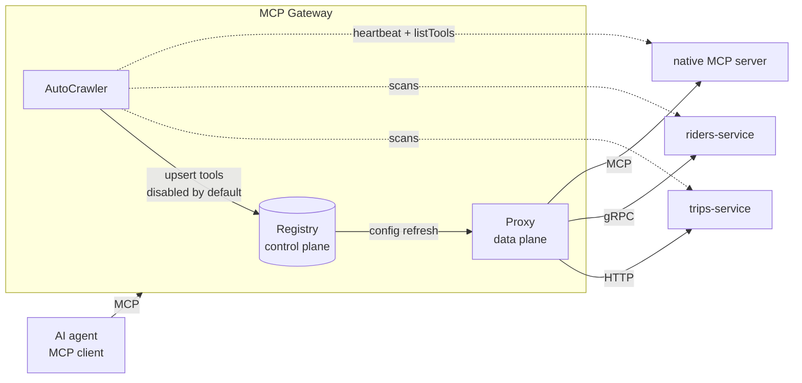

# MCP Gateway — Roadmap

Goal: build a small, working copy of **Uber's MCP Gateway** in Python, step by step.

Source design: [Designing MCP Gateway: Uber's MCP Management Platform](https://www.uber.com/us/en/blog/designing-mcp-gateway/) (Uber Engineering, 2026-10-01).

**The idea in one line:** AI agents talk MCP. Company services talk HTTP or gRPC.
The gateway sits in the middle, so every existing API becomes an MCP tool with
**zero changes** to the services, and security, logging, and discovery live in one place.

---

## Uber's version → our version

| Uber | What it is | Ours (runs on a laptop, free) |
|---|---|---|
| Thousands of internal services | The APIs agents want to use | 2 fake services: `trips-service` (HTTP) and `riders-service` (gRPC) |
| IDL registry (Protobuf/Thrift) | Where every API's shape is written down | A folder of `.proto` files + an OpenAPI file |
| MCP Registry | Catalog of servers and tools | SQLite database + small admin API |
| Proxy Gateway | Runs each MCP call at runtime | FastAPI app with one `/<service>/mcp` endpoint per server |
| Cadence workflows | Scheduled background jobs | A simple scheduled job in Python |
| Muttley service mesh | Routes service-to-service calls | Direct HTTP/gRPC calls (a plain lookup table) |
| TChannel | Old Uber-only protocol | Skipped (HTTP + gRPC teach the same idea) |
| LLM-written tool descriptions | Better tool text for agents | Ollama (free local model) |
| Access Control System | Who may call which tool | Our own small policy table |
| Registry UI | Web dashboard | Admin API first, optional UI at the end |

**Stack:** Python 3.14, `uv`, MCP Python SDK (`mcp` 2.x, same as `mcp-mastery`), FastAPI, `httpx`, `grpcio`, SQLite, Ollama, pytest.

**Rules:** one small step at a time. Abhishek writes all the code. Each phase ends with a check you can run.

---

## Phase 0 — Foundations (no gateway code yet)

- [ ] 0.1 What a gateway is, and why Uber needed one (the "every team builds its own" mess)
- [ ] 0.2 Control plane vs data plane: the "office that keeps the list" vs the "worker who does the job"
- [ ] 0.3 HTTP vs gRPC vs MCP: three ways for programs to talk
- [ ] 0.4 Project setup: `uv init`, folders, first commit

## Phase 1 — Build a mini "Uber" to put behind the gateway

- [ ] 1.1 `trips-service`: FastAPI HTTP service (`get_trip`, `list_trips`) with an OpenAPI spec
- [ ] 1.2 `riders-service`: gRPC service written from a `.proto` file (`GetRider`)
- [ ] 1.3 A native MCP server (`weather-mcp`) built with the MCP SDK
- **Check:** call each service directly with `curl`, a gRPC client, and the MCP Inspector

## Phase 2 — The Registry (control plane)

- [ ] 2.1 SQLite tables: `servers`, `tools` (name, description, input schema, downstream target, `enabled`)
- [ ] 2.2 Add a server and its tools by hand; every tool starts **disabled**
- [ ] 2.3 Admin API: list servers, list tools, enable / disable a tool
- **Check:** add a tool, see it disabled, enable it, see it enabled

## Phase 3 — The Proxy Gateway v1 (data plane, HTTP only)

- [ ] 3.1 One MCP endpoint per server: `/<service-name>/mcp`
- [ ] 3.2 `tools/list` returns only **enabled** tools from the registry
- [ ] 3.3 `tools/call` → turn MCP arguments into an HTTP request → call `trips-service` → turn the reply back into an MCP result
- [ ] 3.4 Errors: downstream down, bad arguments, unknown tool → clean MCP errors
- **Check:** an MCP client gets a real trip from `trips-service` through the gateway

## Phase 4 — gRPC translation

- [ ] 4.1 Read a `.proto` file at runtime (descriptors, no hand-written code per service)
- [ ] 4.2 JSON → Protobuf bytes → gRPC call → Protobuf bytes → JSON
- [ ] 4.3 Turn a Protobuf message into a JSON Schema for the tool's input
- **Check:** the same MCP client gets a rider from `riders-service`

## Phase 5 — Proxy native MCP servers

- [ ] 5.1 Register `weather-mcp` as a virtual server in the registry
- [ ] 5.2 Forward `tools/list` and `tools/call` to it, pass the replies back unchanged
- **Check:** one gateway now serves HTTP, gRPC, and native MCP tools

## Phase 6 — AutoCrawler (automatic discovery)

- [ ] 6.1 Scan the OpenAPI file → create HTTP tools
- [ ] 6.2 Scan the `.proto` folder → create gRPC tools (methods, schemas, doc comments)
- [ ] 6.3 Heartbeat: native MCP servers announce "I'm alive"; the crawler calls `listTools` on them
- [ ] 6.4 Upsert = create if new, update if changed; always **disabled by default**
- [ ] 6.5 Run on a schedule; detect added / changed / removed APIs
- [ ] 6.6 LLM writes agent-friendly tool descriptions (Ollama)
- **Check:** add a new endpoint to `trips-service`; it shows up in the registry, disabled, without you touching the registry

## Phase 7 — Ownership and governance

- [ ] 7.1 Each server has an owner team; only the owner can enable it
- [ ] 7.2 Edits to a tool create a **config diff** that must be approved
- [ ] 7.3 Versions: every approved change is saved; roll back to an older version
- **Check:** edit a description, approve it, roll it back

## Phase 8 — Live config refresh

- [ ] 8.1 Data plane keeps tools in memory and refreshes from the registry every N seconds
- [ ] 8.2 Enable / disable / edit takes effect **without restarting** the gateway
- **Check:** disable a tool while the gateway runs; the next `tools/list` no longer shows it

## Phase 9 — Security

- [ ] 9.1 Caller identity: who is calling (human, service, or agent) from a token header
- [ ] 9.2 Policies per server, with per-tool overrides (allow / deny)
- [ ] 9.3 PII redaction: hide emails, phone numbers, card numbers in tool responses
- [ ] 9.4 Rate limiting per caller
- **Check:** an agent token is denied a write tool; a rider's phone number comes back as `***`

## Phase 10 — Third-party (3P) MCP servers

- [ ] 10.1 A fake external MCP server (stands in for Jira / Google)
- [ ] 10.2 Gateway relays the user's token; a small service swaps it for an external token
- **Check:** call the external tool through the gateway; the internal token never leaves

## Phase 11 — Scaling features (from the "Extending the Gateway" section)

- [ ] 11.1 **Omni MCP**: one server with `discover_server`, `discover_tools`, `get_tool_schema`, `invoke_tool`
- [ ] 11.2 **Response Projection**: the agent asks for only the fields it needs; the gateway trims the response
- [ ] 11.3 **Code Mode CLI**: `gw mcp list`, `gw mcp search`, `gw mcp call` (output to files, not to model context)
- **Check:** measure tokens: full tool list vs Omni MCP, full response vs projected response

## Phase 12 — Production readiness

- [ ] 12.1 Structured logs and a request ID on every call
- [ ] 12.2 Metrics: per-tool latency, error rate, call count (Prometheus)
- [ ] 12.3 Tests: unit tests per layer + one end-to-end test through the whole gateway
- [ ] 12.4 Docker Compose: gateway + registry + 3 services in one command
- [ ] 12.5 Load test: find how many calls per second the gateway handles
- [ ] 12.6 Optional: small web dashboard for the registry
- **Check:** `docker compose up`, run the end-to-end test, read the metrics

---

## Progress

| Phase | Status |
|---|---|
| 0 Foundations | not started |
| 1 Mini Uber | not started |
| 2 Registry | not started |
| 3 Proxy v1 (HTTP) | not started |
| 4 gRPC | not started |
| 5 Native MCP proxy | not started |
| 6 AutoCrawler | not started |
| 7 Governance | not started |
| 8 Live refresh | not started |
| 9 Security | not started |
| 10 3P servers | not started |
| 11 Scaling features | not started |
| 12 Production | not started |

**Current step:** 0.1
