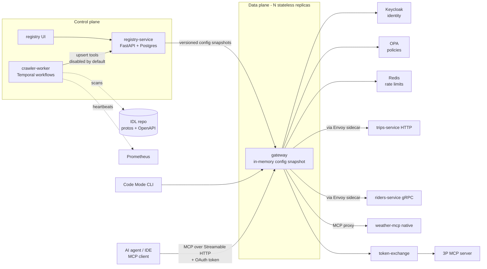

# MCP Gateway — Roadmap (production-grade)

Goal: build **Uber's MCP Gateway** in Python, as close to production as one person can run on a laptop.
Every phase ships a real, tested, deployable service, not a toy script.

Source design: [Designing MCP Gateway: Uber's MCP Management Platform](https://www.uber.com/us/en/blog/designing-mcp-gateway/) (Uber Engineering, 2026-10-01).

**The idea in one line:** AI agents talk MCP. Company services talk HTTP and gRPC.
The gateway sits in the middle: every existing API becomes an MCP tool with **zero changes**
to the services, and discovery, security, and observability live in one place.

---

## Target architecture

**Deployables (each its own container):** `registry-service`, `gateway`, `crawler-worker`,
`token-exchange`, `trips-service`, `riders-service`, `weather-mcp`, `ext-mcp`, `registry-ui`.

---

## Uber's system → ours

| Uber | Job | Ours (open source, free) |
|---|---|---|
| Thousands of internal services | APIs agents want | `trips-service` (HTTP), `riders-service` (gRPC), `weather-mcp` (native MCP) |
| IDL registry (Protobuf / Thrift) | Source of truth for API shapes | Git folder of `.proto` + OpenAPI files, built with `buf` into descriptor sets |
| MCP Registry | Catalog: servers, tools, owners, enablement | `registry-service`: FastAPI, Postgres, SQLAlchemy, Alembic migrations |
| Proxy Gateway | Runs MCP calls, translates protocols | `gateway`: stateless FastAPI + MCP SDK, many replicas |
| Cadence | Durable scheduled workflows | **Temporal** (built by Cadence's creators; official Python SDK) |
| Muttley sidecar | Service mesh routing | **Envoy** sidecar (retries, timeouts, outlier detection, mTLS) |
| Heartbeat metric from MCPFx servers | Detects native MCP servers | Our small `mcpfx` helper exposes a heartbeat metric to **Prometheus** |
| Access Control System (attribute-based) | Who may call which tool | **Keycloak** (OAuth / OIDC identity) + **OPA** (policy engine) |
| PII redaction | Strip sensitive data | **Microsoft Presidio** |
| LLM tool descriptions | Agent-friendly tool text | **Ollama** (local model) |
| 3P token exchange | Swap internal token for Jira / Google token | `token-exchange` service using OAuth Token Exchange (RFC 8693) |
| Registry UI | Owners review and enable tools | `registry-ui` (late phase) |
| TChannel | Uber-only legacy protocol | Skipped: HTTP + gRPC teach the same translation idea |

**Stack:** Python 3.14, `uv` workspace (monorepo), `mcp` 2.x, FastAPI, `httpx`, `grpcio`,
`temporalio`, SQLAlchemy + `asyncpg`, Alembic, Redis, Presidio, OpenTelemetry, Prometheus,
Grafana, Docker Compose → Kubernetes (`kind`) + Helm, GitHub Actions.
(All Python packages checked: they install on Python 3.14.)

---

## Production bar (every step must pass this)

| Rule | Meaning |
|---|---|
| Tests | Unit tests for logic; integration tests against real Postgres / Redis (Testcontainers) |
| Types + lint | `mypy --strict` and `ruff` pass |
| CI green | GitHub Actions runs lint, types, tests, image build on every push |
| Config | From environment variables (`pydantic-settings`), never hard-coded |
| Timeouts | Every network call has a timeout; no call waits forever |
| Health | `/healthz` (alive) and `/readyz` (ready for traffic) on every service |
| Logs | Structured JSON logs with a request ID |
| Errors | Clean MCP errors for agents; full details only in logs |

---

## Phase 0 — Foundations and repo setup

- [ ] 0.1 What a gateway is; why Uber needed one ("every team builds its own" mess)
- [ ] 0.2 Control plane vs data plane
- [ ] 0.3 HTTP vs gRPC vs MCP: three ways programs talk
- [ ] 0.4 Monorepo with `uv` workspace: `services/`, `libs/`, `idl/`, `deploy/`
- [ ] 0.5 Tooling: `ruff`, `mypy`, `pytest`, `pre-commit`, `Makefile`
- [ ] 0.6 GitHub Actions CI: lint → types → tests
- [ ] 0.7 Docker Compose skeleton: Postgres, Redis
- **Check:** CI is green on an empty project

## Phase 1 — A mini "Uber" behind the gateway

- [ ] 1.1 `trips-service`: FastAPI HTTP API (`GET /trips/{id}`, `GET /trips`), OpenAPI spec, Postgres
- [ ] 1.2 `idl/` folder: `riders.proto`; `buf lint` and `buf build` in CI
- [ ] 1.3 `riders-service`: gRPC server from the proto; gRPC health checks
- [ ] 1.4 `libs/mcpfx`: tiny helper for native MCP servers (exposes heartbeat metric)
- [ ] 1.5 `weather-mcp`: native MCP server built with `mcpfx`
- [ ] 1.6 Dockerfile per service; all start with `docker compose up`
- **Check:** call each service with `curl`, `grpcurl`, and the MCP Inspector

## Phase 2 — Registry service (control plane)

- [ ] 2.1 Data model: `servers`, `tools`, `owners`, `tool_versions`, `audit_log`
- [ ] 2.2 Alembic migrations (schema changes are versioned, never by hand)
- [ ] 2.3 Async SQLAlchemy repository layer
- [ ] 2.4 Admin REST API: create / list / get servers and tools; pagination
- [ ] 2.5 Every new server and tool starts **disabled**
- [ ] 2.6 Enable / disable endpoints; each change writes an audit log row
- [ ] 2.7 Integration tests against real Postgres (Testcontainers)
- **Check:** create a tool, see it disabled, enable it, read the audit log

## Phase 3 — Gateway v1: data plane over HTTP

- [ ] 3.1 Config snapshot: load all enabled servers + tools from the registry at startup
- [ ] 3.2 Virtual MCP servers: one Streamable HTTP endpoint per server at `/<service-name>/mcp`
- [ ] 3.3 `tools/list` returns only enabled tools
- [ ] 3.4 HTTP handler: MCP arguments → HTTP request (path, query, body) → JSON → MCP result
- [ ] 3.5 Error mapping: unknown tool, bad arguments, downstream 4xx / 5xx, timeout
- [ ] 3.6 Resilience: timeouts, retries only for safe (idempotent) calls, circuit breaker
- [ ] 3.7 Stateless: run 2 replicas behind a load balancer; both serve correctly
- **Check:** an MCP client gets a real trip through the gateway; kill `trips-service` and get a clean error

## Phase 4 — gRPC translation (dynamic, no per-service code)

- [ ] 4.1 Load `buf` descriptor sets at runtime
- [ ] 4.2 Protobuf message → JSON Schema (tool `inputSchema`)
- [ ] 4.3 JSON → Protobuf bytes → gRPC call → Protobuf bytes → JSON
- [ ] 4.4 Deadlines and gRPC status codes → MCP errors
- **Check:** get a rider through the gateway; add a new proto method and it works with zero gateway code changes

## Phase 5 — Native MCP proxy

- [ ] 5.1 Register `weather-mcp` as a virtual proxy server
- [ ] 5.2 Forward `tools/list` and `tools/call`; pass results back unchanged
- [ ] 5.3 Connection pooling and timeouts to native servers
- **Check:** one gateway serves HTTP, gRPC, and native MCP tools

## Phase 6 — Service mesh (Muttley → Envoy)

- [ ] 6.1 Envoy sidecar next to the gateway; all downstream calls go through it
- [ ] 6.2 Move retries, timeouts, outlier detection into Envoy config
- [ ] 6.3 mTLS between gateway and services
- **Check:** kill one of two `trips-service` replicas; Envoy routes around it

## Phase 7 — AutoCrawler on Temporal

- [ ] 7.1 Temporal basics: workflow, activity, worker, schedule (cron)
- [ ] 7.2 Workflow `CrawlIDL`: scan `idl/` + OpenAPI → for each service: upsert server, parse methods, translate schema, upsert tools
- [ ] 7.3 Activity: LLM writes agent-friendly descriptions (Ollama), with fallback to doc comments
- [ ] 7.4 Workflow `CrawlNative`: read heartbeats from Prometheus → call `listTools` → upsert proxy server
- [ ] 7.5 Idempotent upserts (running twice changes nothing); detect changed and removed APIs
- [ ] 7.6 Everything discovered lands **disabled**
- **Check:** add an endpoint to `trips-service`; it appears in the registry, disabled, with no manual step; kill the worker mid-run and it resumes

## Phase 8 — Ownership and governance

- [ ] 8.1 Each server has an owner team; only owners can enable or edit
- [ ] 8.2 Any edit to a tool creates a **config diff** waiting for owner approval
- [ ] 8.3 Approved changes become a new immutable version; rollback to any version
- [ ] 8.4 Crawler updates never overwrite owner edits silently
- **Check:** edit a description, approve, deploy, roll back

## Phase 9 — Live config distribution

- [ ] 9.1 Registry publishes versioned snapshots
- [ ] 9.2 Gateway polls with ETag; swaps the in-memory snapshot atomically
- [ ] 9.3 Registry down → gateway keeps serving the last known good snapshot
- **Check:** disable a tool while traffic runs; it disappears within N seconds, no restart, no failed requests

## Phase 10 — Security

- [ ] 10.1 Keycloak realm; agents, humans, and services get OAuth tokens
- [ ] 10.2 Gateway validates JWTs (issuer, audience, expiry); MCP authorization metadata
- [ ] 10.3 Actor types: human, service, agent
- [ ] 10.4 OPA policies at server level with tool-level overrides
- [ ] 10.5 Presidio redacts PII in tool responses
- [ ] 10.6 Redis rate limits per caller and per tool
- [ ] 10.7 Audit log of every tool call (who, what, when, result)
- **Check:** an agent token is denied a write tool; a rider's phone number returns redacted; caller 101 in a minute gets rate-limited

## Phase 11 — Third-party MCP servers

- [ ] 11.1 `ext-mcp`: fake external server (stands in for Jira / Google) with its own auth
- [ ] 11.2 Gateway relays the user token; `token-exchange` swaps it (RFC 8693)
- [ ] 11.3 Gateway still enforces auth, rate limits, redaction on 3P calls
- **Check:** call the external tool; the internal token never reaches it

## Phase 12 — Scaling features ("Extending the Gateway")

- [ ] 12.1 **Omni MCP**: `discover_server`, `discover_tools`, `get_tool_schema`, `invoke_tool`
- [ ] 12.2 Server search by intent (embeddings in Postgres with `pgvector`)
- [ ] 12.3 **Response Projection**: inject a fields parameter; gateway trims responses
- [ ] 12.4 **Code Mode CLI**: `gw mcp list`, `gw mcp search`, `gw mcp call` (output to files)
- **Check:** measure tokens: full tool list vs Omni MCP; full response vs projected

## Phase 13 — Observability and SLOs

- [ ] 13.1 OpenTelemetry traces: agent → gateway → Envoy → service, one trace
- [ ] 13.2 Prometheus metrics: per-tool calls, latency (p50 / p95 / p99), errors, denials
- [ ] 13.3 Grafana dashboards
- [ ] 13.4 SLOs (e.g. p95 gateway overhead, error rate) and alerts
- **Check:** find a slow tool from the dashboard and its trace in under a minute

## Phase 14 — Deploy and operate

- [ ] 14.1 Kubernetes on `kind`; Helm chart per service
- [ ] 14.2 Readiness / liveness probes, graceful shutdown, resource limits
- [ ] 14.3 Autoscaling (HPA) and PodDisruptionBudgets for the gateway
- [ ] 14.4 CI builds and pushes images; deploy with Helm; canary + rollback
- [ ] 14.5 Load test with k6: find max calls per second and the bottleneck
- [ ] 14.6 Chaos drills: kill registry, Temporal, Redis, a downstream; gateway stays up
- [ ] 14.7 Runbooks: what to do when each alert fires
- **Check:** survive every chaos drill with SLOs met

## Phase 15 — Registry UI

- [ ] 15.1 List servers and tools, search, owners
- [ ] 15.2 Review generated tools, edit, approve diffs, enable, roll back
- **Check:** an owner enables a crawled tool without touching the API by hand

---

## Honest gaps vs Uber

| Uber has | We don't | Why |
|---|---|---|
| 800+ servers, 5000+ tools, multi-region | 3 services, 1 laptop cluster | Same design, smaller scale; the load test shows where it would break |
| Thousands of real teams | Fake owner teams | Governance logic is the same |
| TChannel | Not built | Uber-only protocol |

---

## Progress

| Phase | Status |
|---|---|
| 0 Foundations + repo | not started |
| 1 Mini Uber | not started |
| 2 Registry service | not started |
| 3 Gateway v1 (HTTP) | not started |
| 4 gRPC translation | not started |
| 5 Native MCP proxy | not started |
| 6 Service mesh | not started |
| 7 AutoCrawler (Temporal) | not started |
| 8 Governance | not started |
| 9 Live config | not started |
| 10 Security | not started |
| 11 3P servers | not started |
| 12 Scaling features | not started |
| 13 Observability | not started |
| 14 Deploy + operate | not started |
| 15 Registry UI | not started |

**Current step:** 0.1
